## n1


`verstehe / stand`

## n2

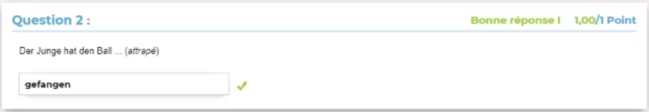

`gefangen`

## n3

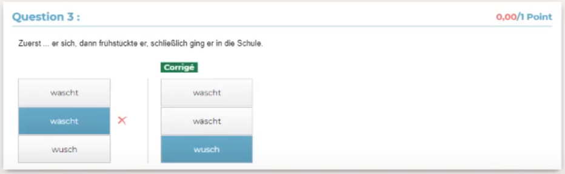

`wusch`

## n4

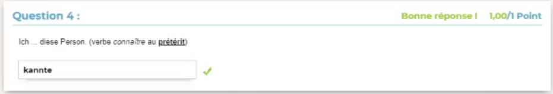

`kannte`

## n5

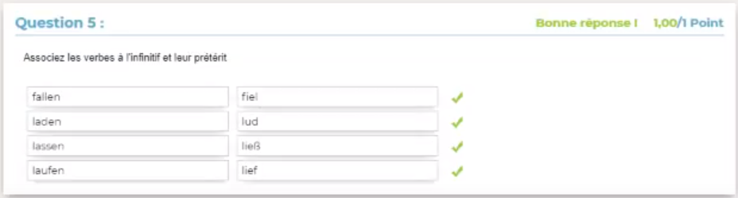

```
fiel
lud
ließ
lief
```

## n6

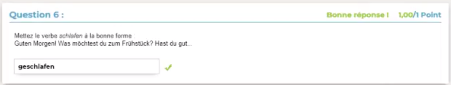

`geschlafen`

## n7

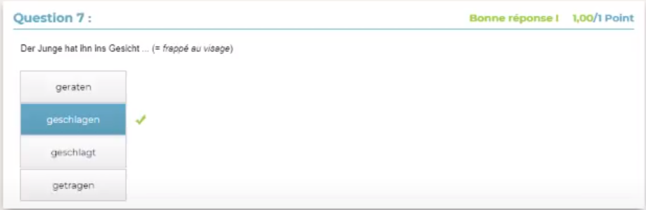

`geschlagen`

## n8 *mit umlaut*

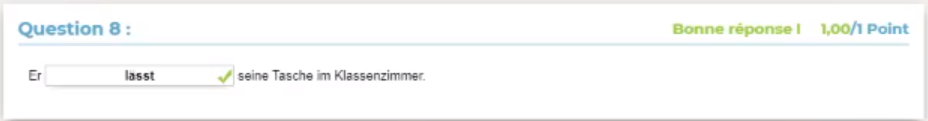

`lässt`

> Avec des trémat `¨` sur le ***ä***

## n9

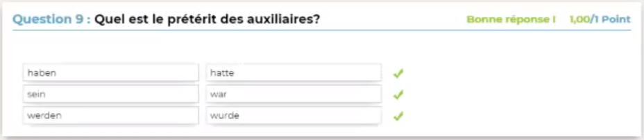

```
hatte
war
wurde
```

## n10

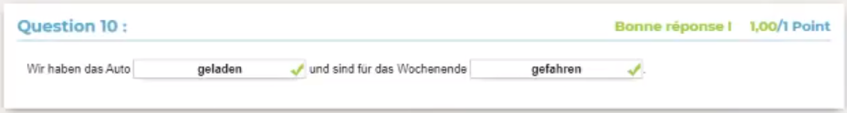

`geladen` ; `gefahren`

## n11 *mit umlaut*

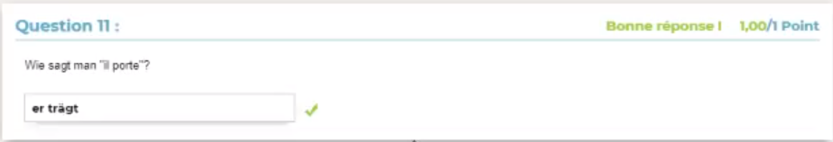

`er trägt`

> Avec des trémat `¨` sur le ***ä***

## n12

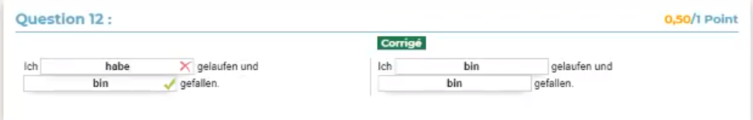

`bin` ; `bin`

## n13

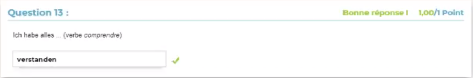

`verstanden`

## n14

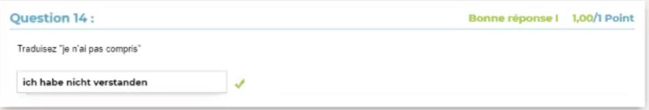

`ich habe nicht verstanden`

## n15


`gedacht`

## n16

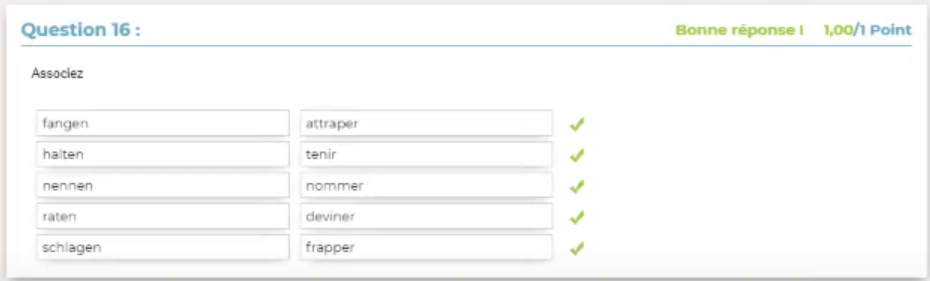

```
attraper
tenir
nommer
deviner
frapper
```

## n17

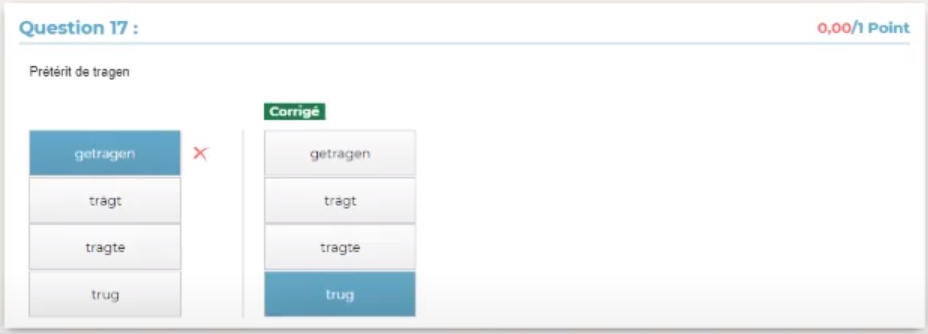

`trug`

## n18

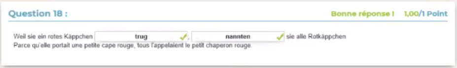

`trug` ; `nannten`

## n19

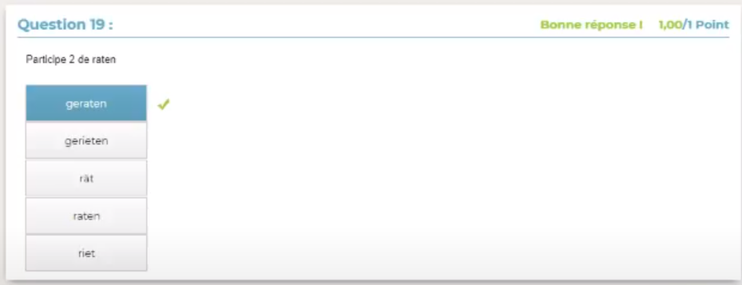

`geraten`

## n20


`hat gewachsen`

> Avec *ch* **puis** *s* : gewa**ch*s***en
