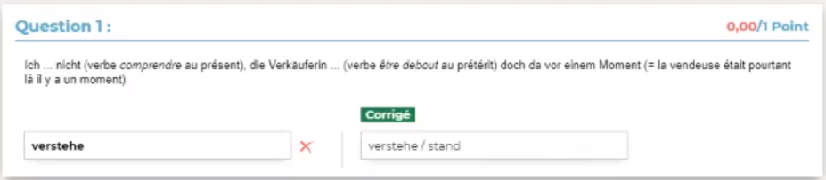

## n1



`verstehe / stand`

## n2


`gefangen`

## n3


`wusch`

## n4


`kannte`

## n5


```
fiel
lud
ließ
lief
```

## n6


`geschlafen`

## n7


`geschlagen`

## n8 *mit umlaut*


`lässt`

> Avec des trémat `¨` sur le ***ä***

## n9


```
hatte
war
wurde
```

## n10


`geladen` ; `gefahren`

## n11 *mit umlaut*


`er trägt`

> Avec des trémat `¨` sur le ***ä***

## n12


`bin` ; `bin`

## n13


`verstanden`

## n14


`ich habe nicht verstanden`

## n15


`gedacht`

## n16


```
attraper
tenir
nommer
deviner
frapper
```

## n17


`trug`

## n18


`trug` ; `nannten`

## n19


`geraten`

## n20


`hat gewachsen`

> Avec *ch* **puis** *s* : gewa**ch*s***en
