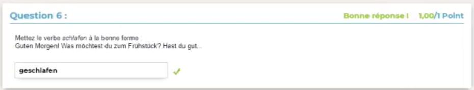
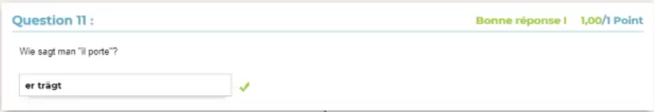
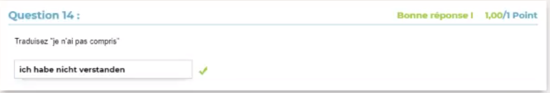
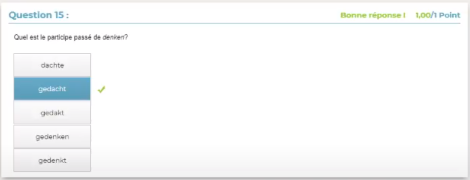
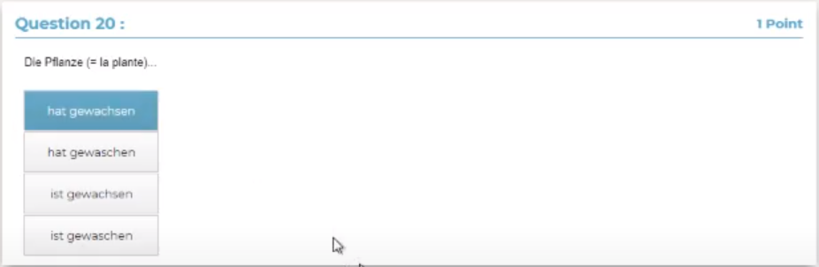
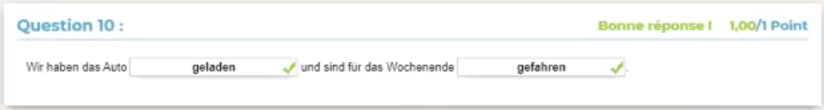
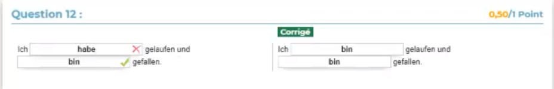
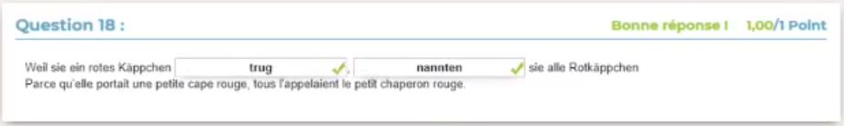
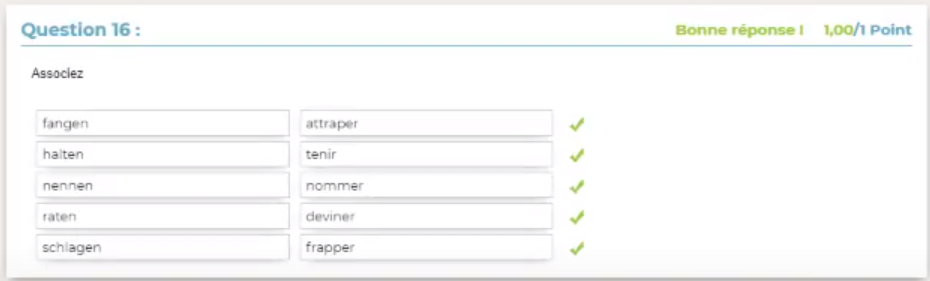

# A l'écrit


`verstehe / stand`


`gefangen`


`kannte`



`geschlafen`



`er trägt`

> Avec des trémat `¨` sur le ***ä***


`verstanden`



`ich habe nicht verstanden`

# Choisir


`wusch`


`geschlagen`



`gedacht`


`trug`


`geraten`



`hat gewachsen`

> Avec *ch* **puis** *s* : gewa**ch*s***en

# Compléter


`lässt`

> Avec des trémat `¨` sur le ***ä***



`geladen` ; `gefahren`



`bin` ; `bin`



`trug` ; `nannten`

# Liste

## n5


```
fiel
lud
ließ
lief
```

## n9


```
hatte
war
wurde
```

## n16



```
attraper
tenir
nommer
deviner
frapper
```
