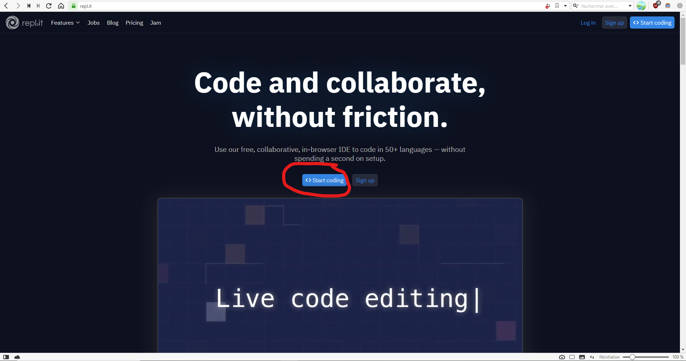
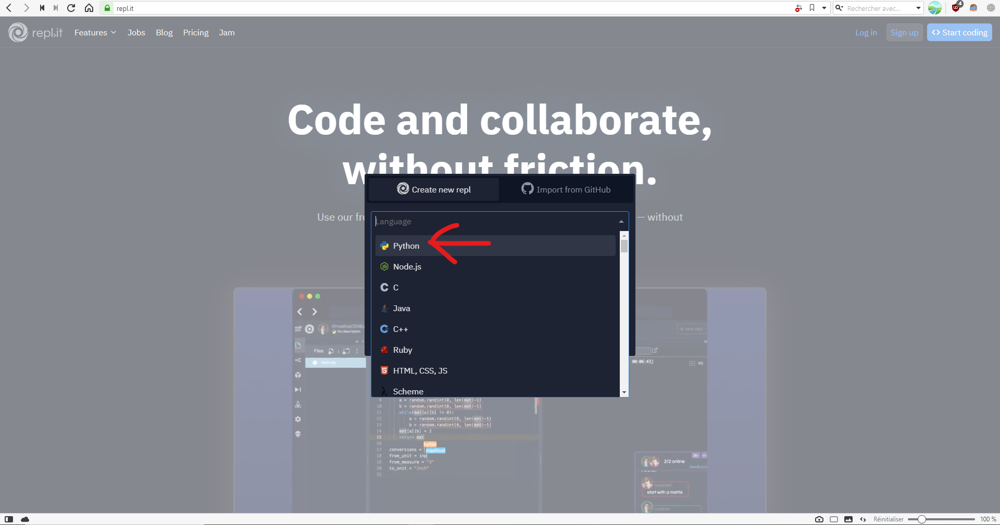
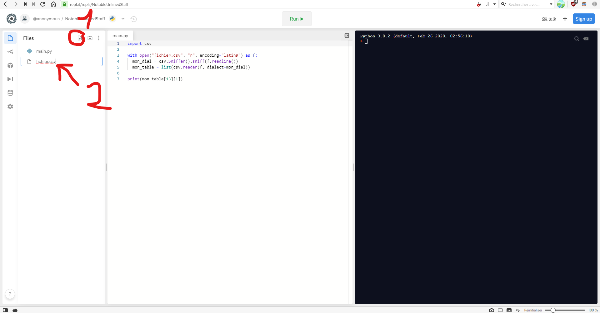

# Script python

### Sommaire :

* [Créer le projet](#créer-le-projet)
* [Créer le script](#créer-le-script)
* [Créer le fichier `.csv`](#créer-le-fichier-csv)
* [Exécuter le script](#exécuter-le-script)

## Créer le projet

Se rendre sur [l'IDE](https://repl.it) et créer un projet vide.

> NOTE : **il n'y a pas besoin de se créer un compte.**

Sélectionner `python` puis cliquer sur `create repl`

> Il est possible que le site demande de résoudre des problèmes pour vérifier que vous êtes bien un humain (recaptcha)

## Créer le script

Coller le texte suivant dans la **partie centrale** :

    import csv
    
    with open("fichier.csv", "r", encoding="latin9") as f:
      mon_dial = csv.Sniffer().sniff(f.readline())
      mon_table = list(csv.reader(f, dialect=mon_dial))
    
    print(mon_table[13][1])
    
## Créer le fichier `.csv`

Créer un nouveau fichier et l'appeler `fichier.csv` (cliquer sur l'icone "" en haut à gauche) :

Cliquer sur `fichier.csv` dans la partie à gauche et coller le texte suivant dans la **partie centrale** :

    CodeProduit,NomProduit,PrixtTTC,CodeCategorie,EnStock(O/N)
    31,1l Jus Pom. Brt,"1,78",1,O
    34,2kg orange jus,"3,49",1,O
    35,"1,5kg orange esp","2,25",1,N
    37,Baguette Rust,"0,9",1,O
    39,Bsc Ptt Lyceen,"2,45",1,O
    40,Bsc Dino,289,1,N
    44,Dent. TpWhite,"1,09",2,O
    47,Galette rois,"7,5",1,O
    50,Lave glace E 5l,2,1,N
    51,Huile 5W30 3l,"15,95",2,O
    54,Lave glace H 5l,"2,5",1,O
    59,Mgrt Canard,"7,52",1,O
    61,N&N'S 250g,"3,49",1,O
    70,Pain epice miel,"2,12",1,O
    71,Semoule Kebab,"2,94",1,O
    83,Buche citron,"9,42",1,O

## Exécuter le script

Cliquer sur `Run >` en haut de l'écran, le résultat s'affiche à droite (sur la partie noire) :

